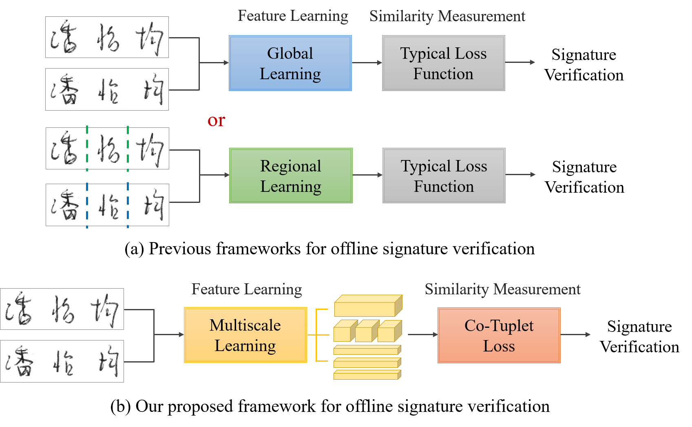
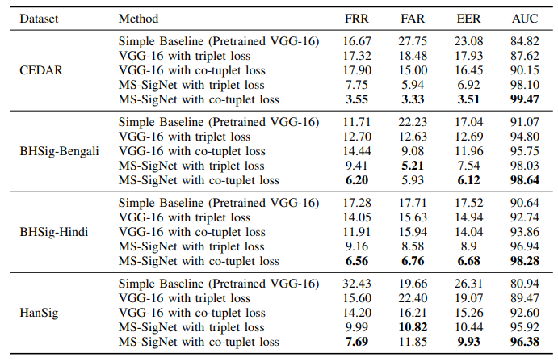

# MS-SigNet
MultiScale Signature feature learning Network for offline handwritten signature verification

* The proposed `MS-SigNet` can capture and integrate global and regional information from various spatial scales to generate discriminative features.
* The proposed `co-tuplet loss` can learn the distance metric for handwritten signature verification. The loss aims to transform input features into a feature space where genuine signatures from the same writer are close to each other while corresponding forgeries are far away from genuine ones.



## Experimental Results ##

Performance comparison between different combinations of models and losses (evaluation metrics in %)



## Implementation ##
* Python ≥ 3.8
* PyTorch framework
* NVIDIA GPUs are needed for both training and testing

## Citation ##

If you use MS-SigNet or co-tuplet loss in your research, please cite our work: </br>
[**F.-H. Huang and H.-M. Lu. Multiscale Feature Learning Using Co-Tuplet Loss for Offline Handwritten Signature Verification. *arXiv preprint arXiv:2308.00428*, 2023.**](https://arxiv.org/abs/2308.00428 "游標顯示")


```
@misc{huang2023multiscale,
      title = {Multiscale Feature Learning Using Co-Tuplet Loss for Offline Handwritten Signature Verification}, 
      author = {Fu-Hsien Huang and Hsin-Min Lu},
      year = {2023},
      eprint = {2308.00428},
      archivePrefix = {arXiv},
      primaryClass = {cs.CV}
}
```

## License ##
This code is distributed under MIT license (refer to the LICENSE file for details).
